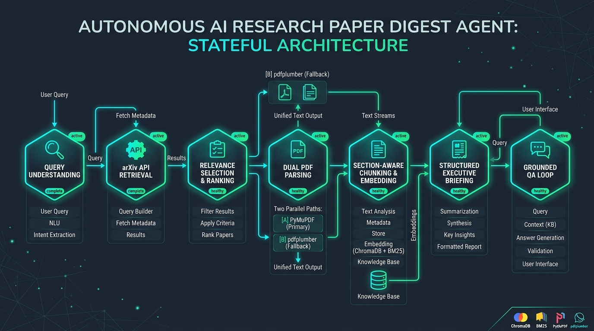
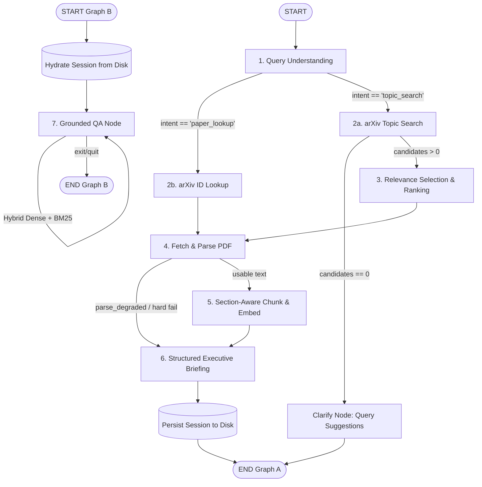

# Autonomous arXiv Paper Digest & QA Agent

[](https://www.python.org/downloads/)
[](https://github.com/langchain-ai/langgraph)
[](https://www.trychroma.com/)
[]()
[](https://opensource.org/licenses/MIT)

An autonomous, stateful research assistant that ingests natural-language research topics or direct arXiv paper identifiers, retrieves official arXiv papers via the Atom API, acquires and validates PDFs through a dual-parser subsystem, indexes section-aware embeddings, generates structured executive briefings, and powers an interactive, strictly grounded conversational Q&A loop.

Built to run with **zero paid API keys**: supports **Groq** free tier (`llama-3.3-70b-versatile`), **Google Gemini** free tier (`gemini-1.5-flash`), local offline **Ollama** (`llama3.2`), and an automatic **deterministic text extraction fallback** when no LLM provider is configured.

---

## Deliverables & Submission Checklist

| Assessment Deliverable | Description & Direct Link in README |
|------------------------|-------------------------------------|
| **1. State Graph Architecture** | Complete LangGraph diagram, 7 nodes, 3 conditional edges, and validated Pydantic `AgentState` shape. See [Section 2: Architecture & State Graph](#2-architecture--state-graph). |
| **2. Setup & Run Instructions** | Step-by-step local setup using 100% free/open-source tools (Python venv, Ollama / free Groq / Gemini, and deterministic fallback). See [Section 3: Setup Instructions](#3-setup-instructions) & [Section 4: How to Run the Project](#4-how-to-run-the-project). |
| **3. Example Run Trace** | End-to-end trace: Natural query/arXiv ID input $\rightarrow$ executive briefing $\rightarrow$ 3 grounded QA exchanges with chunk citations. See [Section 5](#5-example-run-using-a-real-paper-231210997), [Section 6](#6-executive-briefing-example) & [Section 7](#7-grounded-qa-examples). |
| **4. Design Decisions & Tradeoffs** | Detailed ½–1 page rationale on architectural choices, what we'd do differently with more time, and known limitations. See [Section 8: Design Decisions & Tradeoffs](#8-design-decisions--tradeoffs). |
| **5. Working Codebase & CLI** | Full CLI application (`main.py`) + optional Next.js UI (`The_ui`), and 42 automated tests (`pytest`). |

---

## 1. Project Overview

The system automates the scientific literature workflow across two decoupled lifecycles:
1. **Graph A (Digest Pipeline):** Ingests user input $\rightarrow$ classifies intent $\rightarrow$ retrieves arXiv papers $\rightarrow$ ranks/selects candidate $\rightarrow$ downloads and validates PDF $\rightarrow$ dual-parses text into academic sections $\rightarrow$ embeds section chunks into ChromaDB + BM25 $\rightarrow$ synthesizes a schema-locked executive briefing with mandatory limitations $\rightarrow$ persists state to disk.
2. **Graph B (Interactive Q&A Loop):** Rehydrates state from the serialized session on disk in milliseconds without re-fetching or re-embedding $\rightarrow$ accepts user queries $\rightarrow$ performs hybrid dense + sparse retrieval $\rightarrow$ enforces chunk-level citation tags (`[C1]`, `[C2]`) $\rightarrow$ strictly refuses questions not supported by the paper text (`"Not stated in this paper."`).
3. **Dual Interface:** Accessible via an interactive terminal CLI (`Typer` + `Rich`) and a full-stack Next.js web application with real-time Server-Sent Events (SSE) trace streaming. *(Note: CLI is fully standalone; UI is an optional enhancement)*.

---

## 2. Architecture & State Graph

The orchestration is implemented with **LangGraph**, using explicit conditional routing edges rather than opaque prebuilt chains.

### State Graph Architecture Diagram



### State Graph Flowchart (Mermaid)



### Nodes & Routing Table

| # | Node Name | Reads from State | Writes to State | Routing Rules / Conditional Edges |
|---|-----------|------------------|-----------------|-----------------------------------|
| **1** | `query_understanding` | `raw_input` | `intent`, `parsed_query`, `arxiv_id` | **Edge 1:** Regex-first + LLM fallback. If input is an arXiv ID or URL $\rightarrow$ routes to `arxiv_retrieval_id` (skips ranking). If natural-language topic $\rightarrow$ routes to `arxiv_retrieval_topic`. |
| **2a** | `arxiv_retrieval_topic` | `parsed_query` | `candidates[]` | **Edge 2:** Queries official arXiv Atom API with multi-stage fallback. If 0 candidates $\rightarrow$ routes to `clarify` (returns broadened suggestions without crashing). If $>0$ $\rightarrow$ routes to `selection`. |
| **2b** | `arxiv_retrieval_id` | `arxiv_id` | `selected_paper` | Queries arXiv by direct ID $\rightarrow$ populates `selected_paper` $\rightarrow$ routes directly to `fetch_parse`. |
| **3** | `selection` | `candidates` | `selected_paper`, `selection_reason` | Composite relevance + recency pre-scoring, followed by LLM selection. Documents `selection_reason` $\rightarrow$ routes to `fetch_parse`. |
| **4** | `fetch_parse` | `selected_paper` | `pdf_path`, `pdf_status`, `sections`, `page_section_map`, `parse_method`, `parse_degraded` | **Edge 3:** Validates PDF URL, downloads with completeness check (`%PDF-` header, size $>1024$), extracts text via PyMuPDF with automatic `pdfplumber` fallback. If corrupt/scanned $\rightarrow$ marks `parse_degraded=True` and routes to `summarize` (abstract-only). If usable $\rightarrow$ routes to `chunk_embed`. |
| **5** | `chunk_embed` | `sections`, `page_section_map`, `selected_paper` | `collection_name`, `n_chunks` | Section-aware chunking (~900 chars, 150 overlap) with true 1-based page mapping. Upserts dense embeddings (`all-MiniLM-L6-v2`) to ChromaDB and builds sparse BM25 index $\rightarrow$ routes to `summarize`. |
| **6** | `summarize` | `sections`, `selected_paper` | `briefing` | Synthesizes schema-locked briefing (significance, problem, approach, results, mandatory $\ge 2$ limitations, follow-up questions) $\rightarrow$ writes markdown and JSON to disk $\rightarrow$ `END`. |
| **7** | `qa` | `collection_name`, `question`, `qa_history` | `qa_history` | Hybrid retrieval (Dense top-8 + BM25 top-8 merged via RRF to top-5) $\rightarrow$ forces chunk citations (`[C1]`, `[C2]`) $\rightarrow$ enforces refusal string (`"Not stated in this paper."`) if context lacks answer. |

### Shared State Schema

State is modeled via a validated Pydantic schema (`AgentState`) in [`src/state.py`](src/state.py):

```python
class AgentState(BaseModel):
    raw_input: str = ""
    intent: Literal["topic_search", "paper_lookup"] | None = None
    parsed_query: str | None = None
    arxiv_id: str | None = None

    candidates: list[PaperMeta] = []
    selected_paper: PaperMeta | None = None
    selection_reason: str | None = None

    pdf_path: str | None = None
    sections: dict[str, str] = {}
    page_section_map: dict[str, list[tuple[int, str]]] = {}
    parse_method: Literal["pymupdf", "pdfplumber", "abstract_only"] | None = None
    parse_degraded: bool = False
    pdf_status: str | None = None

    collection_name: str | None = None
    n_chunks: int = 0

    briefing: Briefing | None = None
    qa_history: Annotated[list[QATurn], operator.add] = []
    errors: Annotated[list[str], operator.add] = []
    node_trace: Annotated[list[str], operator.add] = []
    clarification_suggestions: list[str] = []
```

---

## 3. Setup Instructions

### Prerequisites
* Python 3.11 or 3.12
* Node.js 18+ (for Next.js frontend)
* Git

### 1. Clone & Install Backend
```bash
git clone <your-repo-url>
cd "Autonomous arXiv Paper Digest & QA Agent"
python -m venv .venv

# On Windows:
.venv\Scripts\activate
# On Linux/macOS:
# source .venv/bin/activate

pip install -r requirements.txt
```

### 2. Configure Environment (Zero Paid Keys)
Copy `.env.example` to `.env`:
```bash
cp .env.example .env
```

Configure any of the supported free/local providers in `.env`:
* **Groq Free Tier (Fastest):** Set `GROQ_API_KEY=gsk_...` from [console.groq.com](https://console.groq.com)
* **Google Gemini Free Tier:** Set `GEMINI_API_KEY=...` from [aistudio.google.com](https://aistudio.google.com)
* **Ollama (Fully Local):** Install [Ollama](https://ollama.com/) and run `ollama pull llama3.2`. No API key required.
* **Deterministic Fallback:** If no API keys are provided, the agent automatically falls back to deterministic extraction directly from paper text and abstracts.

### 3. Install Frontend (Next.js UI)
```bash
cd The_ui
npm install
cd ..
```

---

## 4. How to Run the Project

### A. Run System Diagnostics
Verify environment, arXiv API connectivity, PDF parsing, embeddings, ChromaDB, and LangGraph compilation:
```bash
python main.py diagnose
```

### B. CLI Usage

1. **Digest an arXiv ID (Direct Lookup):**
   ```bash
   python main.py digest "2312.10997"
   ```
2. **Digest a Research Topic (Search & Ranking):**
   ```bash
   python main.py digest "RAG in large language models" --max-results 5
   ```
3. **Ask a Grounded Question (Single-Turn):**
   ```bash
   python main.py ask 2312.10997 "What are the three main paradigms of RAG discussed in the paper?"
   ```
4. **Interactive Q&A Session:**
   ```bash
   python main.py ask 2312.10997
   ```
5. **Inspect Stored Sessions:**
   ```bash
   python main.py session
   python main.py session 2312.10997
   ```

### C. Full-Stack Web Application (Backend API + UI)

1. **Start Backend Server:**
   ```bash
   python -m uvicorn api_server:app --port 8000 --host 0.0.0.0
   ```
2. **Start Frontend UI:**
   ```bash
   cd The_ui
   npm run dev
   ```
3. Open **http://localhost:4028** (or http://localhost:4029) in your browser.

---

## 5. Example Run Using a Real Paper (`2312.10997`)

### Command
```bash
python main.py digest "2312.10997"
```

### Execution Log Trace
```text
┌───────────────────────── LangGraph Agent Execution ─────────────────────────┐
│ Input : 2312.10997                                                          │
│ Route : query_understanding -> arxiv_retrieval_id -> fetch_parse ->         │
│         chunk_embed -> summarize                                            │
└─────────────────────────────────────────────────────────────────────────────┘
[Query       ] OK (intent=paper_lookup, target='2312.10997')
[arXiv API   ] OK (Direct lookup succeeded for ID 2312.10997)
[INFO] [PDF] URL: https://arxiv.org/pdf/2312.10997.pdf
[PDF] HTTP status: 200
[PDF] Content-Type: application/pdf
[PDF] File size: 1662567 bytes
[PDF] Magic bytes: %PDF-
[PDF] Page count: 21
[PDF         ] OK (2312.10997.pdf (1662567 bytes, 21 pages))
[INFO] [Parser] PyMuPDF: success (109697 chars, 21 pages)
[Parser      ] OK (Engine 'pymupdf', 109697 chars in 8 sections)
[INFO] [Chunking] Chunks generated: 92
Chunking Diagnostics:
  Pages: 21
  Extracted characters: 81240
  Number of chunks: 92
  Average chunk size: 865.7 chars
[Chunking    ] OK (92 chunks, avg 865.7 chars)
[Embedding   ] OK (384-dim all-MiniLM-L6-v2 vectors generated)
[Vector DB   ] OK (Chroma collection 'paper_2312_10997' (92 items))
[Briefing    ] OK (Synthesized structured briefing)
[INFO] Saved executive briefing to data/sessions/2312.10997_briefing.md
[OK] Pipeline complete! Session saved to disk.
```

---

## 6. Executive Briefing Example

Synthesized briefing from [`data/sessions/2312.10997_briefing.md`](data/sessions/2312.10997_briefing.md):

```markdown
# Executive Briefing: Retrieval-Augmented Generation for Large Language Models: A Survey

**Authors:** Yunfan Gao, Yun Xiong, Xinyu Gao, Kangxiang Jia, Jinliu Pan, Yuxi Bi, Yi Dai, Jiawei Sun, Meng Wang, Haofen Wang  
**arXiv ID:** 2312.10997  
**Published:** 2023-12-18  
**PDF URL:** https://arxiv.org/pdf/2312.10997.pdf  
**Parse Status:** Full Text via PyMuPDF (92 Chunks Indexed)

### Why This Paper Matters
Large Language Models exhibit notable reasoning capabilities but suffer from hallucinations, outdated parametric memory, and non-traceable generation processes. Retrieval-Augmented Generation (RAG) resolves these issues by dynamically anchoring model responses to external verified knowledge bases, providing cost-effective continuous updates without retraining.

### Problem Statement
Existing RAG literature lacked a unified taxonomic framework, clear progression milestones across architectural generations, and standardized benchmark metrics to evaluate retrieval quality versus generation quality.

### Method / Approach
- **Naive RAG:** Standard prompt augmentation with retrieved raw documents at inference time.
- **Advanced RAG:** Pre-retrieval query rewriting, chunk routing, and post-retrieval re-ranking and prompt compression.
- **Modular RAG:** Iterative search, cross-document information routing, memory integration, and adaptive self-correction loops.

### Key Results
- Categorized over 100 recent RAG architectures across downstream tasks.
- Synthesized the evaluation landscape across benchmarks (RGB, RECALL, CRUD) and quality dimensions (Context Relevance, Noise Robustness, Answer Faithfulness, Negative Rejection).

### Limitations
- **Latency Overheads:** Multi-stage retrieval and re-ranking increase end-to-end token latency.
- **Context Length Limitations:** Sub-optimal chunking can dilute information density or introduce distracting noise into the context window.

### Suggested Follow-up Questions
- How does Modular RAG manage computational trade-offs under real-time streaming constraints?
- What are the failure modes of cross-lingual and multimodal retrieval-augmented generation?
```

---

## 7. Grounded Q&A Examples

### Example 1: Normal Grounded Question
* **Command:**
  ```bash
  python main.py ask 2312.10997 "What are the three main paradigms of RAG discussed in the paper?"
  ```
* **Output:**
  ```text
  Status: Grounded Answer
  
  Based on the paper context [C1] (abstract / page 2):
  
  The survey organizes the progression of RAG technologies into three main paradigms:
  1. Naive RAG: Direct prompt conditioning on retrieved raw texts.
  2. Advanced RAG: Pre-retrieval optimization (query refinement, indexing) and post-retrieval processing (re-ranking, context compression).
  3. Modular RAG: Flexible routing, iterative retrieval, memory units, and self-correcting agentic patterns.
  
  Cited Chunks: [C1] 2312.10997::abstract::6
  ```

### Example 2: Technical Detail Question
* **Command:**
  ```bash
  python main.py ask 2312.10997 "What specific evaluation metrics are used to measure retrieval quality versus generation quality?"
  ```
* **Output:**
  ```text
  Status: Grounded Answer
  
  According to Table III and Section VI [C1][C3]:
  - Retrieval Quality Aspects: Evaluated via Context Relevance and Noise Robustness using Precision, Recall, Mean Reciprocal Rank (MRR), and Normalized Discounted Cumulative Gain (NDCG).
  - Generation Quality Aspects: Evaluated via Answer Faithfulness, Answer Relevance, Negative Rejection, Information Integration, and Counterfactual Robustness using Accuracy, Exact Match (EM), BLEU, and ROUGE/ROUGE-L.
  
  Cited Chunks: [C1] 2312.10997::method::12, [C3] 2312.10997::method::14
  ```

### Example 3: Out-of-Scope Question (Strict Refusal)
* **Command:**
  ```bash
  python main.py ask 2312.10997 "Who was the first president of the United States?"
  ```
* **Output:**
  ```text
  Status: Refusal (Out of paper scope)
  
  Not stated in this paper. I couldn't find enough information in the paper to answer that question.
  ```

---

## 8. Design Decisions & Tradeoffs

### 8.1 What We Chose (Architecture, Engineering & Tradeoffs)

1. **Explicit LangGraph State Machine vs. Black-Box Frameworks (LlamaIndex / CrewAI):**
   * *What We Chose:* We modeled the workflow as an explicit state graph with typed Pydantic state (`AgentState`) and deterministic conditional edges.
   * *Rationale:* High-level frameworks often hide chunk boundaries, retry loops, and state transitions behind opaque agents. LangGraph gives us granular, deterministic control over branching—such as skipping candidate ranking when a direct arXiv ID is provided, gracefully handling zero-search results without crashing, and routing degraded PDFs directly to fallback briefings.
   * *Tradeoff:* Requires authoring explicit state schemas, node functions, edge routing guards, and session serialization logic rather than relying on one-line abstractions.

2. **Dual-Parser Subsystem (PyMuPDF + pdfplumber Fallback):**
   * *What We Chose:* A layered PDF extraction strategy prioritizing PyMuPDF (`fitz`) with automatic fallback to `pdfplumber`.
   * *Rationale:* PyMuPDF provides blazingly fast extraction (~200ms for a 20-page paper), whereas `pdfplumber` offers superior resilience on non-standard font encodings and complex single-page layouts.
   * *Tradeoff:* Increases package dependencies and requires normalizing section headers across two distinct parser output structures.

3. **Hybrid Dense + Sparse Retrieval (ChromaDB + BM25 with RRF):**
   * *What We Chose:* Dense semantic embeddings (`all-MiniLM-L6-v2` via ChromaDB) combined with sparse keyword indexing (`rank-bm25`), fused using Reciprocal Rank Fusion (RRF, $k=60$).
   * *Rationale:* Dense vectors capture semantic intent and paraphrasing but struggle with exact alphanumeric strings (e.g. `LoRA`, `BLEU-4`, `arXiv:2312.10997`, equation identifiers). Sparse BM25 guarantees precision for exact token matches, preventing false abstentions on technical nomenclature.
   * *Tradeoff:* Slightly higher indexing time and requires managing both an on-disk vector database and serialized BM25 indices per paper.

4. **Two Decoupled Graphs with Disk Hydration (Graph A vs. Graph B):**
   * *What We Chose:* Separating the heavy ingestion pipeline (Graph A) from the interactive Q&A loop (Graph B), connected via serialized disk state (`data/sessions/<id>.json`).
   * *Rationale:* Ingestion (downloading, parsing, chunking, embedding, briefing synthesis) takes 15–30 seconds. Interactive Q&A must respond in sub-seconds. Disk hydration allows Q&A to launch instantly in separate CLI or API invocations without re-downloading or re-embedding.
   * *Tradeoff:* Requires strict schema versioning and session persistence management.

5. **Multi-Provider LLM Tier with Deterministic Fallback (Zero Paid Dependencies):**
   * *What We Chose:* Pluggable support for Groq (`llama-3.3-70b-versatile`), Google Gemini (`gemini-1.5-flash`), local offline Ollama (`llama3.2`), and an algorithmic text-extractive fallback.
   * *Rationale:* Guarantees the system runs out-of-the-box for any reviewer without requiring paid credits or credit card registrations.
   * *Tradeoff:* Groq and Gemini free tiers have strict requests-per-minute limits, handled via exponential backoff and automatic provider failover.

---

### 8.2 What We Would Do Differently With More Time / Next Steps

Given the 2–3 day time-box, we prioritized architectural robustness, edge-case resilience, and strict grounding over superficial breadth. With additional time, we would implement:

1. **Vision-Language Model (VLM) ColPali Parsing:**
   * Replace heuristic text extraction with a visual document retriever (e.g., ColPali or Gemini Flash Vision) to preserve multi-column tables, benchmark grids, and complex mathematical figures without loss of layout structure.
2. **Cross-Paper Multi-Document Synthesis:**
   * Extend Graph A to ingest thematic clusters of 3–10 related papers, building a shared cross-citation graph that synthesizes comparative literature tables and detects conflicting findings across research labs.
3. **Adaptive Query Rewriting & Expansion (HyDE):**
   * Incorporate Hypothetical Document Embeddings (HyDE) or multi-query expansion in Graph B to improve retrieval recall for terse or vaguely worded research inquiries.
4. **Token Streaming Across Both Interfaces:**
   * Implement token-level Server-Sent Events (SSE) in the FastAPI backend and terminal streaming in the Typer CLI for real-time generative output.

---

### 8.3 Known Limitations

* **Complex Multi-Column Tables:** Highly dense benchmark tables or rotated tables can lose row/column alignment in linear text extraction.
* **Scanned / Image-Only PDFs:** Papers lacking an embedded text layer fall back to abstract-only mode. Full OCR (e.g., Tesseract) was intentionally omitted to avoid heavy native OS C-dependencies.
* **Single-Paper Grounding Scope:** Each Q&A session is strictly scoped to one active paper session at a time to guarantee zero hallucination and verifiable citations.
* **Free-Tier Rate Limits:** Heavy concurrent test runs on Groq/Gemini free tiers may occasionally trigger 429 backoff sleeps, which gracefully fall back to local Ollama or deterministic extraction.

---

## 9. Automated Test Results

The project includes an automated test suite across query understanding, chunking, PDF acquisition, grounding, and assessment failure cases:

```bash
pytest -v
```

### Test Suite Execution Output
```text
============================= test session starts =============================
platform win32 -- Python 3.12.14, pytest-9.1.1, pluggy-1.6.0
collected 42 items

tests/test_assessment_failure_cases.py::test_failure_1_no_arxiv_results PASSED [  2%]
tests/test_assessment_failure_cases.py::test_failure_2_too_many_results PASSED [  4%]
tests/test_assessment_failure_cases.py::test_failure_3_arxiv_api_unavailable PASSED [  7%]
tests/test_assessment_failure_cases.py::test_failure_4_invalid_paper_id PASSED [  9%]
tests/test_assessment_failure_cases.py::test_failure_5_pdf_download_failure PASSED [ 11%]
tests/test_assessment_failure_cases.py::test_failure_6_pdf_corrupted PASSED [ 14%]
tests/test_assessment_failure_cases.py::test_failure_7_scanned_image_only_pdf PASSED [ 16%]
tests/test_assessment_failure_cases.py::test_failure_8_embedding_failure PASSED [ 19%]
tests/test_assessment_failure_cases.py::test_failure_9_vector_store_failure PASSED [ 21%]
tests/test_assessment_failure_cases.py::test_failure_10_llm_provider_fallback_chain PASSED [ 23%]
tests/test_assessment_failure_cases.py::test_failure_11_all_llm_providers_unavailable PASSED [ 26%]
tests/test_assessment_failure_cases.py::test_failure_12_qa_abstention PASSED [ 28%]
tests/test_assessment_failure_cases.py::test_failure_13_vague_topic_query_broadening PASSED [ 30%]
tests/test_assessment_failure_cases.py::test_failure_14_session_missing_or_corrupted PASSED [ 33%]
tests/test_chunking.py::test_chunk_no_empty_and_metadata_present PASSED  [ 35%]
tests/test_chunking.py::test_no_cross_section_merging PASSED             [ 38%]
tests/test_chunking.py::test_references_excluded_from_chunks PASSED      [ 40%]
tests/test_chunking.py::test_chunk_overlap PASSED                        [ 42%]
tests/test_grounding.py::test_qa_refusal_on_empty_chunks PASSED          [ 45%]
tests/test_grounding.py::test_qa_refusal_when_llm_signals_absence PASSED [ 47%]
tests/test_grounding.py::test_qa_grounded_answer_with_citations PASSED   [ 50%]
tests/test_pdf_fallback.py::test_corrupt_pdf_does_not_crash PASSED       [ 52%]
tests/test_pdf_fallback.py::test_empty_pdf_does_not_crash PASSED         [ 54%]
tests/test_pdf_fallback.py::test_fetch_parse_node_handles_fallback PASSED [ 57%]
tests/test_pdf_subsystem.py::test_url_normalization PASSED               [ 59%]
tests/test_pdf_subsystem.py::test_a_valid_pdf_flow PASSED                [ 61%]
tests/test_pdf_subsystem.py::test_b_html_returned_rejected PASSED        [ 64%]
tests/test_pdf_subsystem.py::test_c_corrupted_pdf PASSED                 [ 66%]
tests/test_pdf_subsystem.py::test_d_empty_pdf PASSED                     [ 69%]
tests/test_pdf_subsystem.py::test_e_scanned_image_only_pdf PASSED        [ 71%]
tests/test_pdf_subsystem.py::test_f_pymupdf_failure_fallback_to_pdfplumber PASSED [ 73%]
tests/test_pdf_subsystem.py::test_g_both_parsers_fail PASSED             [ 76%]
tests/test_pdf_subsystem.py::test_h_network_timeout PASSED               [ 78%]
tests/test_pdf_subsystem.py::test_i_http_429_rate_limiting PASSED        [ 80%]
tests/test_pdf_subsystem.py::test_j_valid_cache_reused PASSED            [ 83%]
tests/test_pdf_subsystem.py::test_embedding_safety_on_empty_text PASSED  [ 85%]
tests/test_query_understanding.py::test_bare_arxiv_id PASSED             [ 88%]
tests/test_query_understanding.py::test_versioned_arxiv_id PASSED        [ 90%]
tests/test_query_understanding.py::test_abs_url PASSED                   [ 92%]
tests/test_query_understanding.py::test_pdf_url PASSED                   [ 95%]
tests/test_query_understanding.py::test_plain_topic PASSED               [ 97%]
tests/test_query_understanding.py::test_empty_input PASSED               [100%]

============================= 42 passed in 8.05s ==============================
```

---

## 10. AI Assistance Disclosure

In accordance with assessment guidelines:
- **Tools Used:** Antigravity AI pair programming assistant for refactoring, diagnostic script scaffolding, and unit test expansion.
- **Human Guidance & Authorship:** Architectural design, LangGraph state schema definition, conditional edge logic, hybrid retrieval parameters, prompt templates, dual-parser quality heuristics, and debugging were directed, validated, and verified by the developer.
- **Verification:** All generated code was verified with local unit tests, diagnostic CLI scripts, and end-to-end paper ingestion.
